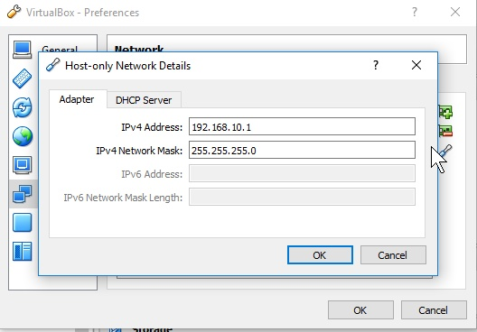
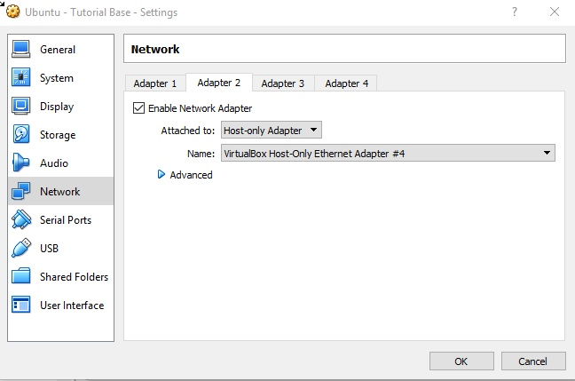
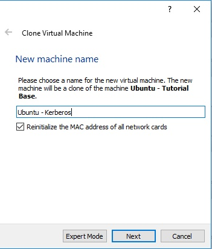
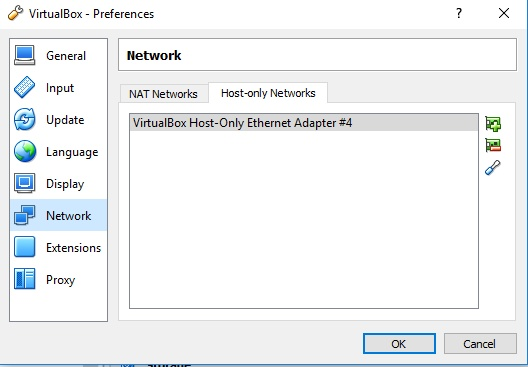

# Stem VM Setup

## Approach


For this test environment, we will be setting up a all VMs in VirtualBox VMs on your local laptop.  

We will first create a "Stem Cell" VM image.  This will be the basis for all the VMs we are using. They will be VirtualBox "link cloned" from this Stem image which has the common preparation before any machine specific setup. 

	Eventually we want to automate this with Vagrant and Ansible (or other such tools).
    

The set up for the base image to clone will have

* Ubuntu 16.04 
* The Virtual Box Network and a base Network

## Linux Version

We will be using Ubuntu 16.04.   Specifically, I used ubuntu-16.04.2-server-amd64.iso to build my Stem VM image.


### Linux Kernel Caveat
The AuriStor package files (.deb) are available for most kernel versions While unlikley, it is possible that if the packages have not yet been built and are unavailable on the AuriStor repository.  

To find out your Linux Kernel version:  
    
>
```
$ uname -r
4.4.0-87-generic
```

# Images









adapter2.jpg
cloneVM.jpg
hostOnlyNetwork.jpg


## Setting up the 
If so, please refer to the instructions [Downgrading your Kernel Version](downgradingKernel.md)

?	Had to see the Windows Caveat, ie network name is not eth1 but was enp0s8
•	cat /sys/class/net   ### Shows Network Adapters
•	Add Host-Only network to /etc/network/interfaces
o	# The Host-Only interface
o	auto enp0s8
o	iface enp0s8 inet static
o	address 192.168.10.102


We will set up the Stem image with the static


> The VirtualBox setup for this machine is not covered here.  A user 'gerry' with root privilages is set up in that process for this example

	Caveat: At the time we did this example, the AuriStor .deb files were only built for kernel version 'linux-image-4.4.0-89-generic'


# Base VM Setup

## GERRY GIT NOISE hammered  in laptop 

## VM Tool: VirtualBox

All VMs are setup on my local laptop using VirtualBox

Network:
* NAT: to provide access to internet for downloading software
* Bridge-Only-Adapter: For the private Network.  Each VM has a Static IP address

## Linux Flavor: Ubuntu

I created one headless Ubuntu install.  All other VMs are clones of that.   The private Bridge network IP is set up static IP Address


## Setup Steps

### Setup of Base Ubuntu 

iso....

### Setup of Base VM Clone for each of the 

Clone steps and network steps....
